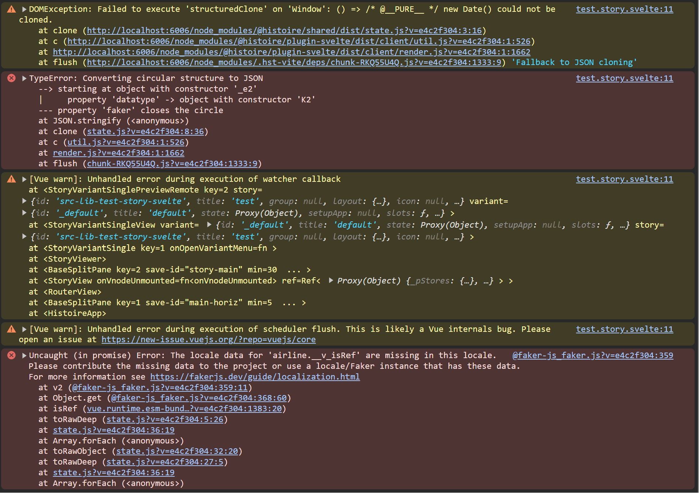

Reproduction steps:
1. `npm run story:dev`
2. Navigate to http://localhost:6006/story/src-lib-test-story-svelte?variantId=_default
3. Try to use the `someBoolean` checkbox in the Histoire Controls sidebar on the right
4. See the following errors in the console
